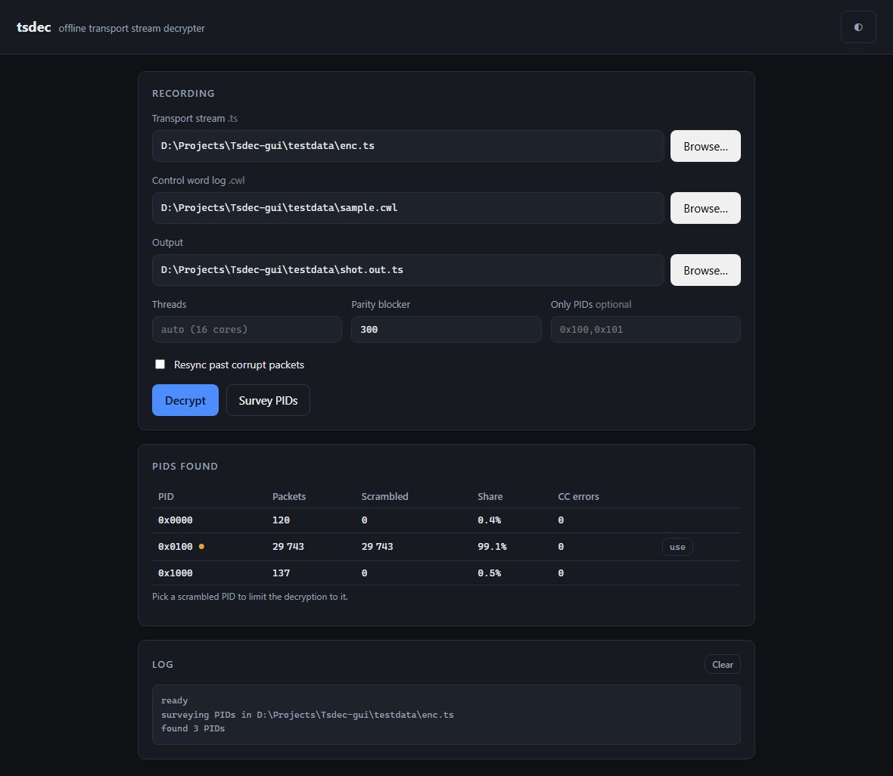
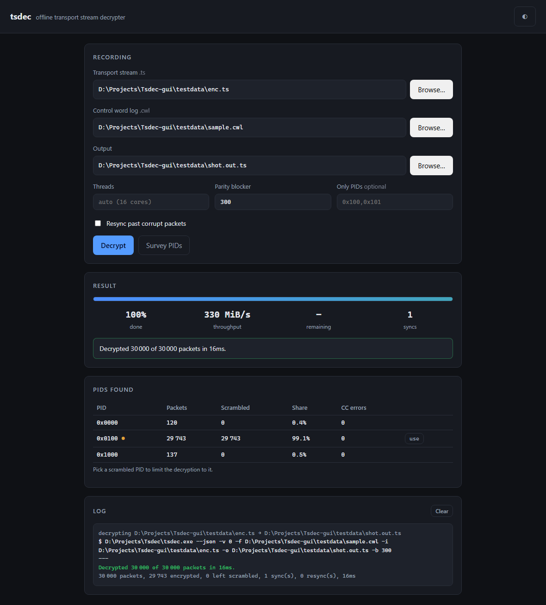
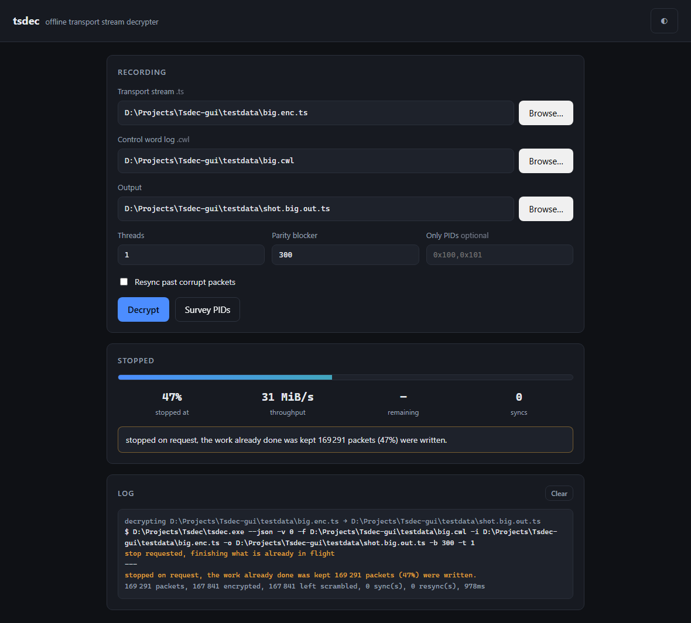

# tsdec-gui

A graphical front end for [TSDEC](https://github.com/prof-abdo/tsdec), the
offline decrypter for recorded DVB transport streams.

TSDEC does the work. This is only the interface around it.


## Getting it

Download `tsdec-gui.exe` from the
[releases page](https://github.com/prof-abdo/tsdec-gui/releases) and run it.
That is the whole installation: the decoder is inside the program, so there
is nothing else to download and nothing to put on your PATH.



## Why a separate repository

TSDEC is a command line tool that ships as a single self-contained binary. The
interface is a different concern with a different lifecycle, and keeping it
apart means neither has to compromise: tsdec keeps its zero dependency, single
file build, and this can iterate on look and feel without touching the decoder.

They talk over the command line. This repository contains no copy of the
decoder and links against none of its code.

## What it does

One job at a time, because that is the honest scope for a first release.

- Pick a `.ts` recording and a `.cwl` control word log, choose an output, and
  run it.
- Watch it happen: a real progress bar with a percentage, a throughput and an
  estimate, fed by the decoder's progress events rather than a timer.
- **Stop a long recording.** The stop is a request, not a kill, so whatever
  was already decrypted is kept, packet aligned and playable, and the result
  says how far it got rather than claiming the run finished. This is the
  button the 0.4.1 Win32 GUI had, and the main reason this exists.
- **Survey the pids** in a recording, with how much of each is scrambled, and
  narrow the run down to the ones wanted when a transponder carries several
  services.
- Thread count, cw blocker in bytes, and resync past corrupt packets.
- Light and dark, following the system preference.
- A log pane, for when a run ends oddly.



Stopping a long recording keeps what was done, and says how far it got rather
than pretending the run completed:



## How it drives TSDEC

Through `tsdec --json`, which writes one JSON object per line: `progress`
events while it works, then a single `result` event with the counts, the
status code and a sentence saying what happened. That is a documented
contract, not scraped log text.

For stopping, it uses `-S <file>`, which asks for the same clean stop that
Ctrl+C does by creating a file. That matters more than it sounds: Ctrl+C is a
console control event, and a windowed program has no console to deliver one
from, so on a real GUI a stop sent that way either does nothing or arrives as
a kill. A file works the same everywhere.

Building this on top of the decoder is what turned up five bugs in it, all
fixed and released:

- log lines that ran together, so a pipe received one long unparsable line
- Ctrl+C that did nothing under Windows for a process in its own group
- a throughput figure that counted processor time instead of elapsed time
- a total missing from the result, so a stopped run had no honest percentage
- no way to stop at all from a caller with no console, which is the GUI

## Building it from source

```sh
python -m venv .venv
.venv/Scripts/pip install PySide6 pyinstaller

# the decoder to bundle
git clone https://github.com/prof-abdo/tsdec.git
make -C tsdec

.venv/Scripts/python tsdec_gui_qt.py          # run it
.venv/Scripts/python -m PyInstaller tsdec_gui.spec   # build the exe
```

`TSDEC_BIN` points the build at a decoder build, and the running program
accepts `--tsdec <path>` to use a different one.

## The other front end

`tsdec_gui.py` is the same thing as a local web interface, which is useful
from a shell, over ssh, or on a machine where installing Qt is a nuisance. It
shares `tsdec_core.py` with the native window, so the two behave identically.
The native build is the one to use on a desktop.

There is also a headless mode, which is what the release job uses to prove the
packaged program actually decrypts:

```sh
tsdec-gui.exe --decrypt -i recording.ts -f log.cwl -o clear.ts
tsdec-gui.exe --self-test
```

## Requirements

TSDEC 2.3 or later, which is where `--json` and `-S` landed. The packaged
Windows build carries its own, so this only matters if you point it at a
different decoder.

## Tests

```sh
python test_qt.py     # the window, driven headless, 41 checks
python test_gui.py    # the web front end, 36 checks
python test_exe.py    # the packaged exe as an artefact, 14 checks
```

Each needs a decoder and its source tree, found the same way the program finds
the decoder, or named with `TSDEC_BIN` and `TSDEC_SRC`. The last one only runs
after a build.

`test_exe.py` is the one that matters most and the one that is easy to skip: it
is the only check that runs the actual packaged program, in an empty folder
with nothing on PATH. Every other check passed while the frozen build was
unable to stop a decode.

## Licence

GPL v3, matching TSDEC.
